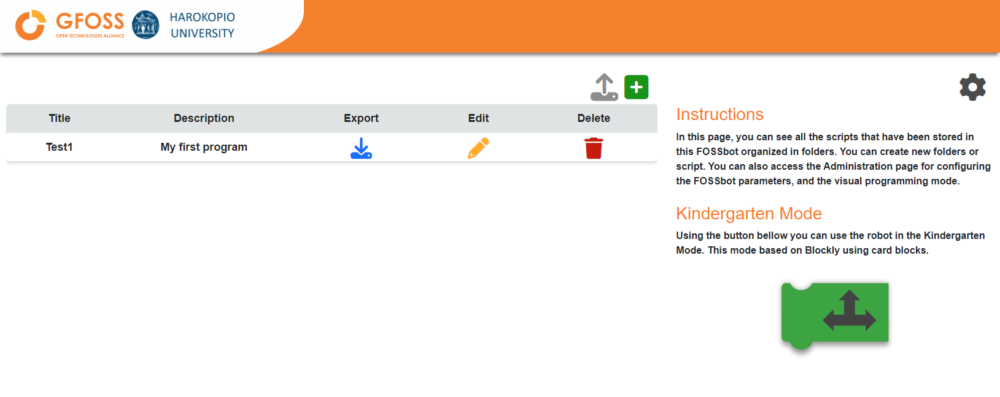
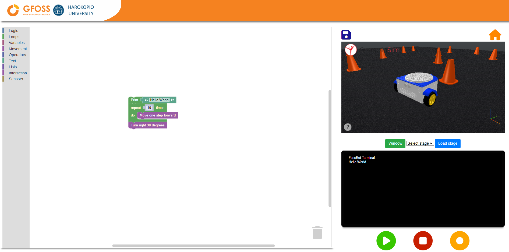

## Fossbot Application


## For the Simulator 

Beta 0.6 under development, please open a github issue for any bug or feature request.

### Installation
1) Download the latest release for your system (Windows, Ubuntu, MacOS) from the Releases section
2) Unzip
3) Install the Coppelia Simulator (EDU or Player) ```https://coppeliarobotics.com/#download```

### At first run
1) Start the ```FossBot Simulator``` app
2) Go to settings sections inside the app
3) Set the path to the CoppeliaSim executable e.g. ```C:\Program Files\CoppeliaRobotics\CoppeliaSimEdu_4.6\CoppeliaSimEdu\coppeliaSim.exe``` or ```/home/user/CoppeliaSim_Edu_4.6/coppeliaSim.sh```
4) Save the settings and restart the app

Now the app will and the CoppeliaSim will start together.

### Usage
1) Start the Coppelia Simulator
2) Load a scene and start the simulation using the play button from top 
3) Start the ```FossBot Simulator``` app
4) Enjoy!


## For the Physical robot 
### Installation
0) Activate the fully assembly FOSSBot and conect with ssh
1) Install the docker on your Raspberry Pi
2) Copy the docker-compose.yaml to the root directory
3) Run ```docker compose -f docker-compose.yaml up -d```

### Usage
1) Connect throught your broswer to http://<Raspberry Pi ip>:8081
2) Enjoy!

## Screenshots



## Software Development Team
* Christos Chronis
* Eleftheria Papageorgiou
* Manousos Linardakis

## Builds
[](https://github.com/chronis10/fossbot-app/actions/workflows/windows_app.yml)

[](https://github.com/chronis10/fossbot-app/actions/workflows/macos_app.yml)

[](https://github.com/chronis10/fossbot-app/actions/workflows/ubuntu_20_04_app.yml)

[](https://github.com/chronis10/fossbot-app/actions/workflows/robot_image.yml)

