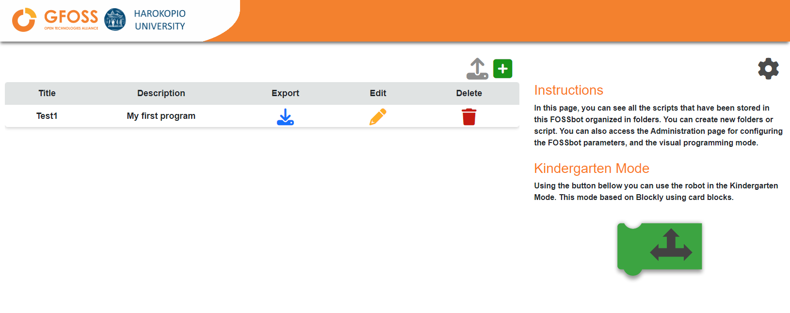

## Fossbot Application



## For the Physical robot 

## Raspberry Pi Images

Burn the image to a microSD card for your robot, and then insert the card into the robot.

[Raspberry Pi Images](http://83.212.81.212:8080/)

### Hardware Diagnostics

If you want to ensure everything is connected correctly, follow the guide provided. We have included a script within the images that checks all the electronic components of the robot.
[Diagnostics](https://github.com/chronis10/fossbot-hardware/blob/main/electronics_instructions/FOSSBot%20Diagnostics.pdf)

### Usage
0) Activate the full assembly FOSSBot and connect with ssh
1) The robot automatically creates an access point. Search for the network with the SSID: ```fossbot-000``` and connect. A pop-up window will appear. You can skip this window if you want to use the robot directly, or you can set the robot to connect to your local network by following the wizard in the pop-up window.
2) Connect through your browser to http://<Raspberry Pi ip>:8081 or http://fossbot-000.local:8081 or http://10.41.0.1:8081 (AP mode)
3) Enjoy!

We have also created and a [User's Manual](https://github.com/chronis10/fossbot-hardware/blob/main/electronics_instructions/FOSSBot%20User%E2%80%99s%20Manual.pdf)

### Without our image
0) Activate the full assembly FOSSBot and connect with ssh
1) Install the docker on your Raspberry Pi
2) Copy the docker-compose.yaml to the root directory
3) Run ```docker compose -f docker-compose.yaml up -d```

### Power Users
* The robot has SSH pre-activated with the username: `pi` and the password: `raspberry`.
* The hostname of the robot is `fossbot-000`. Change it if you have more than one robot.
* The access point functionality is provided using [Comitup](https://davesteele.github.io/comitup/).

## Screenshots

## Software Development Team
* Christos Chronis
* Eleftheria Papageorgiou
* Dimitrios Charitos

## Builds
[](https://github.com/chronis10/fossbot-app/actions/workflows/windows_app.yml)

[](https://github.com/chronis10/fossbot-app/actions/workflows/macos_app.yml)

[](https://github.com/chronis10/fossbot-app/actions/workflows/ubuntu_20_04_app.yml)

[](https://github.com/chronis10/fossbot-app/actions/workflows/robot_image.yml)

